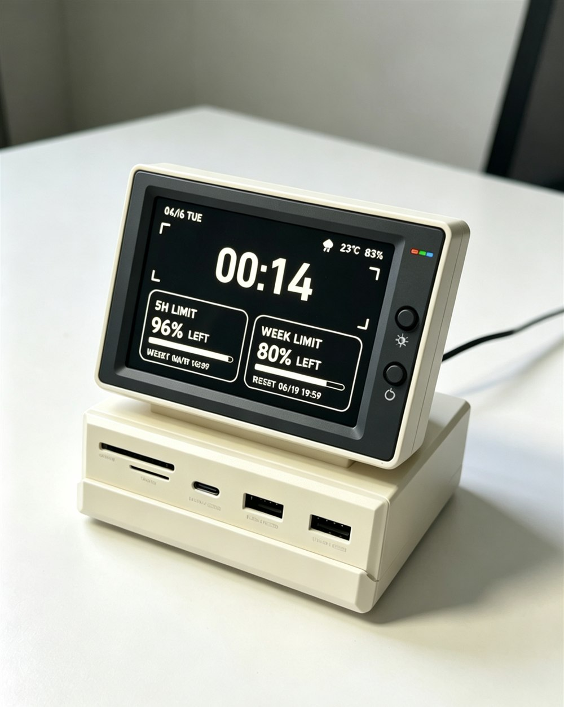

# Claude Usage Screen

**中文** · [English](README.en.md)

[](LICENSE)


一个极简的黑白**信息屏**，适合放在备用显示器或小尺寸 HDMI 屏上当桌面时钟。
它显示一个大号时钟、你的 **Claude Code 用量**（5 小时会话与每周额度，以「剩余 %」+
重置时间呈现）以及当前**天气**。

> **2.0**：时钟旁新增一个 **Claude 红绿灯**——绿=空闲/工作中，黄=普通通知，
> 红=需要你授权或出错。想要最初的纯净版（无红绿灯）请用
> [`v1.0`](https://github.com/AHMUJia/claude-usage/releases/tag/v1.0) 标签
> 或 `main` 分支。

<p align="center">
  
</p>

> 上图为放在桌面上的形态概念图；下图是程序的**实际渲染界面**：


基于 PySide6 —— 单个 Python 文件，无网页框架，可在 Windows / macOS / Linux 运行。

## 快速开始

```bash
git clone git@github.com:AHMUJia/claude-usage.git
cd claude-usage
pip install PySide6              # 想显示用量卡再装： pip install claude-usage-widget
python infoscreen.py --fullscreen
```

**快捷键：** `F` / `F11` 切换全屏 · `Esc` / `Q` 退出。

## 功能

- **大号时钟**，外加取景框式边框（支持 24 / 12 小时制）。
- **Claude 用量卡** —— `5H LIMIT`（当前 5 小时会话）与 `WEEK LIMIT`（本周·全模型）：
  显示**剩余百分比** + 进度条 + **重置时间**。数据来自
  [`claude-usage-widget`](https://pypi.org/project/claude-usage-widget/)。
- **天气**（右上角）：自绘图标（晴 / 多云 / 雨 / 雪 / 雷 / 雾）+ 温度 + 湿度，
  来自 [wttr.in](https://wttr.in)（无需 API key，仅用标准库）。
- **Claude 红绿灯（2.0）**：时钟旁的三灯指示当前 Claude Code 状态——
  绿=空闲/工作中、黄=普通通知、红=等待授权/出错。详见
  [Claude 红绿灯](#claude-红绿灯agent-信号灯20-新增)。
- 纯黑白、适合全屏、单文件自包含。

## 安装

```bash
pip install PySide6
# 可选，用于显示用量卡（需已安装并登录 Claude Code）：
pip install claude-usage-widget
```

## 运行

```bash
python infoscreen.py                 # 窗口模式
python infoscreen.py --fullscreen    # 全屏
python infoscreen.py --city Beijing  # 指定天气城市
```

## 配置

把 `config.example.json` 复制为 `config.json`（与 `infoscreen.py` 同目录）后编辑：

| 键 | 默认值 | 含义 |
|---|---|---|
| `weather_city` | `""` | wttr.in 城市名；留空则按 IP 自动判断 |
| `weather_refresh_seconds` | `900` | 天气刷新间隔（秒） |
| `claude_refresh_seconds` | `300` | 用量刷新间隔（秒） |
| `claude_usage_cmd` | `null` | 输出用量 JSON 的命令；`null` = `python -m claude_usage --once` |
| `time_24h` | `true` | 24 小时制 / 12 小时制 |
| `fullscreen` | `false` | 启动即全屏 |
| `frameless` | `false` | 无边框窗口 |
| `width` / `height` | `960` / `640` | 窗口尺寸 |
| `session_label` / `week_label` | `5H LIMIT` / `WEEK LIMIT` | 两张卡片标题 |
| `font_family` | `Bahnschrift` | Windows 下呈现紧凑字形，其它平台自动回退 |
| `signal_enabled` | `true` | 是否显示 Claude 红绿灯 |
| `signal_state_file` | `null` | 状态文件路径；`null` = 按平台自动（见下） |
| `signal_poll_ms` | `700` | 读状态文件的间隔（毫秒） |
| `signal_show_idle` | `true` | 空闲时是否仍显示常亮绿灯 |
| `signal_completed_ttl` | `60` | 「已完成」绿灯保留秒数，过后回空闲 |
| `signal_session_ttl` | `1800` | 卡住的工作中/空闲会话多久按超时丢弃（30 分钟） |
| `signal_review_ttl` | `300` | 黄灯（通知）多久自动消失（5 分钟） |
| `signal_problem_ttl` | `3600` | 红灯（等授权/出错）保留多久（1 小时，离开久了回来仍报警） |

也可用 `--config 路径/config.json` 指定配置文件。

## 用量数据从哪来？

两张 LIMIT 卡会运行 `python -m claude_usage --once` 并读取它打印的 JSON
（`session_utilization`、`weekly_utilization`、`session_reset`、`weekly_reset`）。
该工具读取**你本地的 Claude Code 数据**、复用 Claude Code 自身的登录态——本程序
**不会把任何数据发往别处**。若未安装 `claude-usage-widget`，卡片只显示 `--`，
时钟与天气照常工作。

> 提示：若你的 Claude 配置目录非默认位置，请按 `claude-usage-widget` 文档配置，
> 或用 `claude_usage_cmd` 指向你自己输出相同 JSON 的脚本。

## Claude 红绿灯（Agent 信号灯，2.0 新增）

时钟旁的三灯实时反映本机 **Claude Code 当前在做什么**：

| 灯 | 含义 | 典型触发 |
|---|---|---|
| 🟢 绿 | 空闲 / 思考 / 工作中 / 刚完成 | 没有会话、`UserPromptSubmit`、`PreToolUse`、`Stop`（成功） |
| 🟡 黄 | 普通通知 / 需查看 | `Notification`（普通） |
| 🔴 红 | 等待你授权 / 出错阻塞 | `Notification`（含 permission/approve）、`Stop` 失败、工具报错 |

全部**常亮不闪烁**（避免分散注意力）。聚合规则是**以新为准**：灯跟着你最近一次动作走；
没有新动作时各状态有保留时长——黄灯 5 分钟自动消失，**红灯保留 1 小时**（你离开电脑久了
回来仍能看到报警），均可在 `config.json` 调。

### 工作原理

```
Claude Code 触发 hook ──> agent_signal_hook.py ──写──> status.json ──读──> 红绿灯
```

Claude Code 每次事件把事件 JSON 经 stdin 交给 `agent_signal_hook.py`，脚本按
「事件→信号→状态」映射后原子写出一个 `status.json`；`infoscreen.py` 定时读它渲染三灯。
若没有该文件，灯就常亮绿（「无事」）。

> 状态文件 schema 与事件映射兼容开源项目
> **[ridyang/Agent-Signal-Bar](https://github.com/ridyang/Agent-Signal-Bar)**，
> 红绿灯的概念与 schema 归功于该项目。这里只是其**写入端**的极简、零依赖重实现，
> 所以你**无需安装那个 App** 也能驱动本屏的灯。

### 安装 hook

把 `agent_signal_hook.py` 放在任意位置，在 Claude Code 的 `settings.json`
（如 `~/.claude/settings.json`）的 `hooks` 段为这些事件各加一条命令，事件名作为参数传入：

```jsonc
{
  "hooks": {
    "PreToolUse":  [ { "matcher": "", "hooks": [ { "type": "command", "command": "python /path/to/agent_signal_hook.py PreToolUse",  "timeout": 5 } ] } ],
    "PostToolUse": [ { "matcher": "", "hooks": [ { "type": "command", "command": "python /path/to/agent_signal_hook.py PostToolUse", "timeout": 5 } ] } ],
    "UserPromptSubmit": [ { "hooks": [ { "type": "command", "command": "python /path/to/agent_signal_hook.py UserPromptSubmit", "timeout": 5 } ] } ],
    "Notification": [ { "hooks": [ { "type": "command", "command": "python /path/to/agent_signal_hook.py Notification", "timeout": 10 } ] } ],
    "Stop":        [ { "hooks": [ { "type": "command", "command": "python /path/to/agent_signal_hook.py Stop", "timeout": 5 } ] } ],
    "SessionStart":[ { "hooks": [ { "type": "command", "command": "python /path/to/agent_signal_hook.py SessionStart", "timeout": 5 } ] } ],
    "SubagentStop":[ { "hooks": [ { "type": "command", "command": "python /path/to/agent_signal_hook.py SubagentStop", "timeout": 5 } ] } ],
    "PreCompact":  [ { "hooks": [ { "type": "command", "command": "python /path/to/agent_signal_hook.py PreCompact", "timeout": 5 } ] } ],
    "SessionEnd":  [ { "hooks": [ { "type": "command", "command": "python /path/to/agent_signal_hook.py SessionEnd", "timeout": 5 } ] } ]
  }
}
```

- **Windows**：建议用 `pythonw.exe`（无控制台窗口，主屏不闪黑框）；路径含中文时放到 ASCII 路径更稳。
- hook 在**新开的会话**才会加载——改完 `settings.json` 请重开 Claude Code 才看得到灯变化。
- 状态文件位置（可用环境变量 `AGENT_SIGNAL_LIGHT_STATE_FILE` 覆盖）：
  - Windows：`%LOCALAPPDATA%\AgentSignalBar\status.json`
  - 其它：`/tmp/agent-signal/status.json`

不想要灯？把 `config.json` 的 `signal_enabled` 设为 `false`，或干脆别装 hook（灯会一直绿）。

## 许可

MIT —— 见 [LICENSE](LICENSE)。

红绿灯部分的概念与状态 schema 来自
[ridyang/Agent-Signal-Bar](https://github.com/ridyang/Agent-Signal-Bar)（同样 MIT）。
