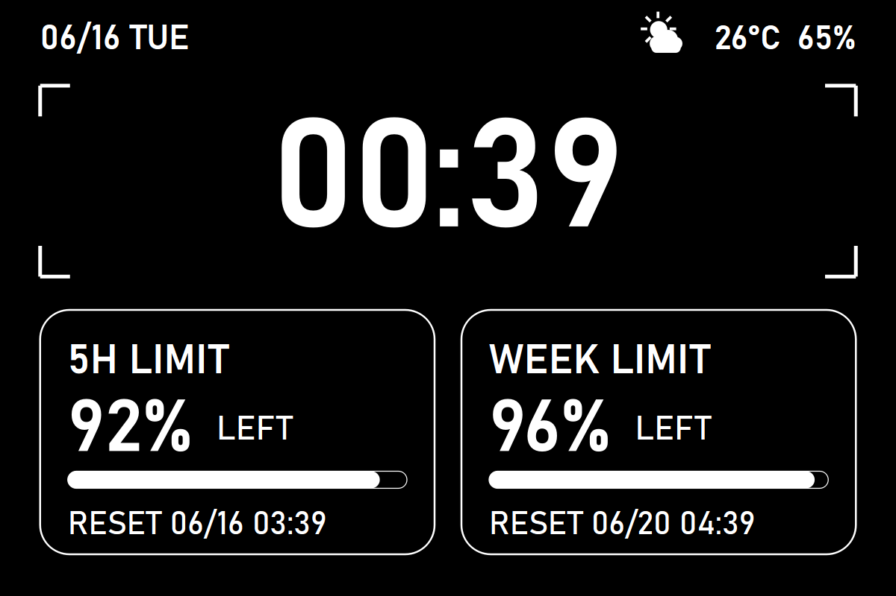

# Claude Usage Screen

[](LICENSE)


A minimalist, monochrome **info screen** for a spare monitor or small HDMI
display. It shows a big clock, your **Claude Code usage** (5‑hour session and
weekly limits, as *% left* with reset times), and the current **weather**.



## Quick start

```bash
git clone git@github.com:AHMUJia/claude-usage.git
cd claude-usage
pip install PySide6              # + `pip install claude-usage-widget` for the usage cards
python infoscreen.py --fullscreen
```

`F` / `F11` toggle fullscreen · `Esc` / `Q` quit.

Built with PySide6 — a single Python file, no web stack, runs on
Windows / macOS / Linux.

## Features

- **Big clock** in a camera‑style "viewfinder" frame (24h or 12h).
- **Claude usage cards** — `5H LIMIT` (current session) and `WEEK LIMIT`
  (weekly, all models): percentage **left**, a progress bar, and the **reset**
  time. Powered by [`claude-usage-widget`](https://pypi.org/project/claude-usage-widget/).
- **Weather** in the top‑right: a hand‑drawn icon (sunny / cloudy / rain /
  snow / thunder / fog) plus temperature and humidity, from
  [wttr.in](https://wttr.in) (no API key, stdlib only).
- Pure monochrome, full‑screen friendly, fully self‑contained.

## Install

```bash
pip install PySide6
# optional, for the usage cards (requires Claude Code installed & logged in):
pip install claude-usage-widget
```

## Run

```bash
python infoscreen.py                 # windowed
python infoscreen.py --fullscreen    # full screen
python infoscreen.py --city Tokyo    # set the weather city
```

**Keys:** `F` / `F11` toggle fullscreen · `Esc` / `Q` quit.

## Configure

Copy `config.example.json` to `config.json` (next to `infoscreen.py`) and edit:

| key | default | meaning |
|---|---|---|
| `weather_city` | `""` | wttr.in city; empty = auto‑detect by IP |
| `weather_refresh_seconds` | `900` | how often to refresh weather |
| `claude_refresh_seconds` | `300` | how often to refresh usage |
| `claude_usage_cmd` | `null` | command that prints the usage JSON; `null` = `python -m claude_usage --once` |
| `time_24h` | `true` | 24‑hour vs 12‑hour clock |
| `fullscreen` | `false` | start in fullscreen |
| `frameless` | `false` | borderless window |
| `width` / `height` | `960` / `640` | window size |
| `session_label` / `week_label` | `5H LIMIT` / `WEEK LIMIT` | card titles |
| `font_family` | `Bahnschrift` | condensed look on Windows; falls back elsewhere |

You can also pass `--config path/to/config.json`.

## Where do the usage numbers come from?

The two LIMIT cards run `python -m claude_usage --once` and read the JSON it
prints (`session_utilization`, `weekly_utilization`, `session_reset`,
`weekly_reset`). That tool reads **your local Claude Code data** and reuses
Claude Code's own login — nothing is sent anywhere by this app. If
`claude-usage-widget` isn't installed, the cards simply show `--` and the clock
and weather still work.

> Tip: if your Claude config lives in a non‑default directory, configure
> `claude-usage-widget` accordingly (see its docs), or point `claude_usage_cmd`
> at your own script that emits the same JSON.

## License

MIT — see [LICENSE](LICENSE).
